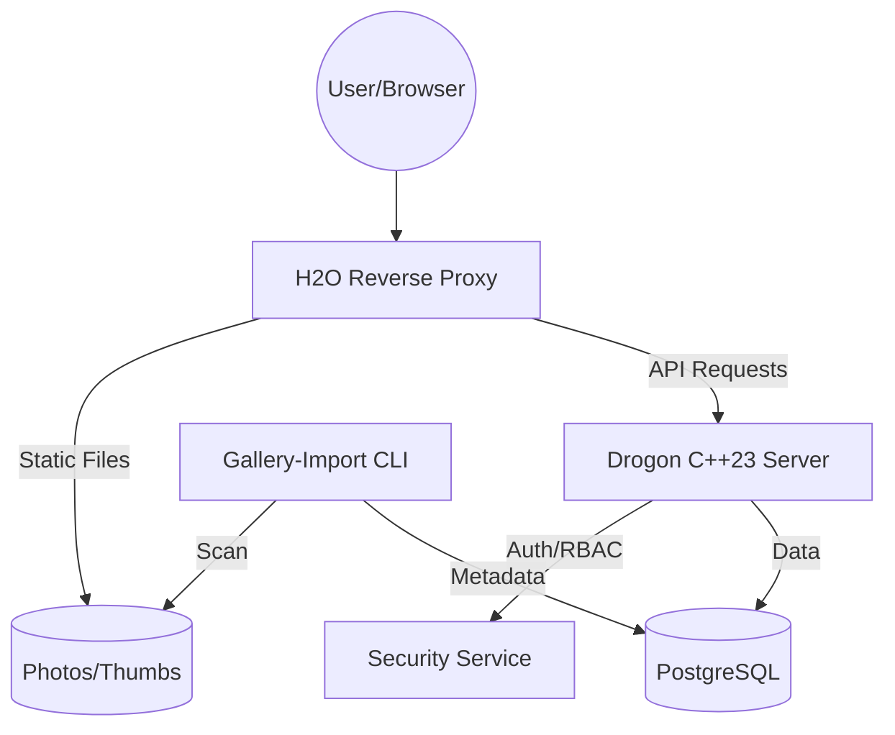

# PhotoGallery Backend (C++23)

[English](#english) | [Deutsch](#deutsch)

---

## English

A modern, high-performance C++23 backend for a photo gallery application, built with **Drogon**, **spdlog**, and **PostgreSQL**.

### 🌟 Key Features
- **Clean Architecture**: Separation of concerns between domain, infra, and API.
- **C++23 Standard**: Utilizes `std::expected`, `std::print`, and monadic operations.
- **Security First**: Argon2id hashing, JWT (HS256), TOTP (2FA), and a dedicated Security Audit Log.
- **Geo-Hierarchy**: Automatic location detection based on folder structures.
- **High Performance**: Asynchronous I/O via Drogon and H2O reverse proxy.

### 📚 Documentation Overview
- **[Installation Guide](docs/documentation/INSTALL_EN.md)**: Setup dependencies on Ubuntu 24.04+.
- **[Development Setup (Docker)](docs/documentation/DEV_SETUP_EN.md)**: Setup with Docker Compose.
- **[Build Instructions](docs/documentation/BUILD_EN.md)**: Compile and run the project.
- **[Architecture](docs/architecture/ARCHITECTURE.md)**: Detailed diagrams and design patterns.

---

## Deutsch

Ein modernes, hochperformantes C++23 Backend für eine Photo-Gallery Anwendung, entwickelt mit **Drogon**, **spdlog** und **PostgreSQL**.

### 🌟 Hauptmerkmale
- **Clean Architecture**: Strikte Trennung von Domain, Infrastruktur und API.
- **C++23 Standard**: Verwendung von `std::expected`, `std::print` und monadischen Operationen.
- **Security First**: Argon2id Hashing, JWT (HS256), TOTP (2FA) und ein dediziertes Security-Audit-Log.
- **Geo-Hierarchie**: Automatische Standort-Erkennung basierend auf der Ordnerstruktur.
- **High Performance**: Asynchrones I/O via Drogon und H2O Reverse Proxy.

### 📚 Dokumentations-Übersicht
- **[Installations-Anleitung](docs/documentation/INSTALL_DE.md)**: Einrichten der Abhängigkeiten unter Ubuntu 24.04+.
- **[Entwicklungs-Setup (Docker)](docs/documentation/DEV_SETUP_DE.md)**: Setup mit Docker Compose.
- **[Build-Anweisungen](docs/documentation/BUILD_DE.md)**: Kompilieren und Ausführen des Projekts.
- **[Architektur](docs/architecture/ARCHITECTURE.md)**: Detaillierte Diagramme und Design-Patterns.

---

## 🧭 Architecture Diagram

