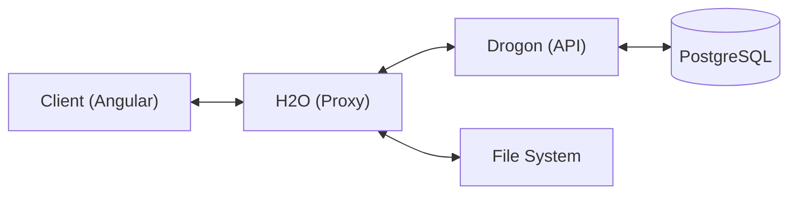
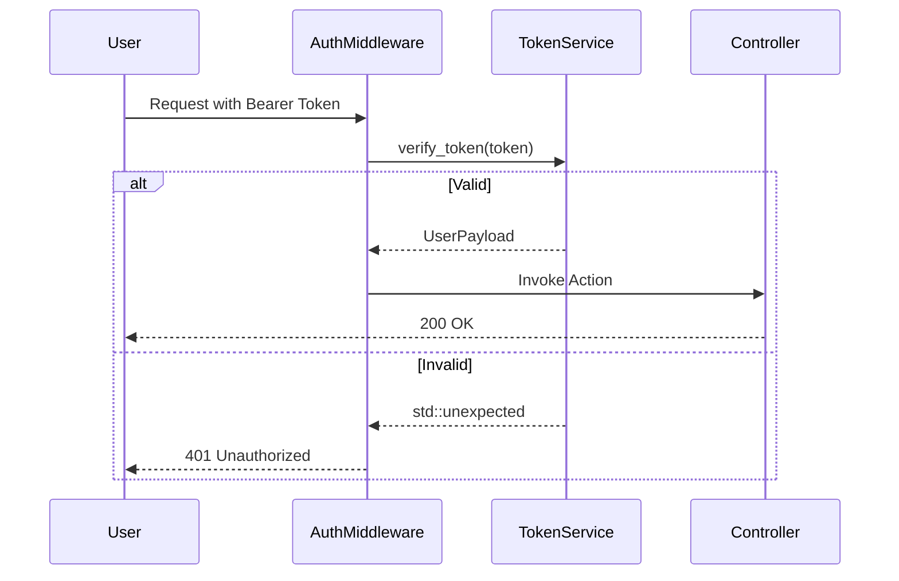

# Architecture Documentation

## 🏗️ Design Philosophy
The backend follows **Clean Architecture** principles to ensure maintainability, testability, and independence from external libraries.

- **Domain Layer**: Contains business logic and entities. No dependencies on frameworks.
- **Infrastructure Layer**: Implements repository interfaces using PostgreSQL and utility tools.
- **API Layer**: Handles HTTP requests, controllers, and middleware using Drogon.

## 📊 Component Diagram

## 🔐 Security Flow (Sequence)

## 📂 Directory Structure
- `src/app`: Application entry points (`main.cpp`, `import_main.cpp`).
- `src/api`: Controllers and Middlewares.
- `src/core`: Core services like Logging and Config.
- `src/domain`: Business logic, Models, and Interfaces.
- `src/infra`: Database repositories and utility scripts.
