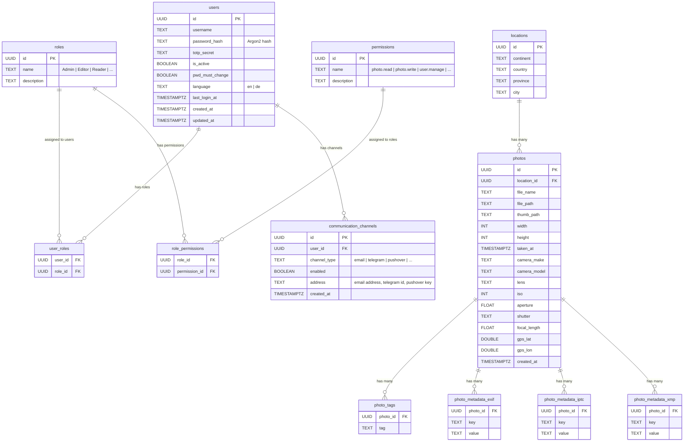

# ER-Diagramm

## 🧭 Beziehungsübersicht

### 1. users

Unabhängig von den restlichen Tabellen

Enthält Login‑Daten, TOTP‑Secret, Rollen

| Feld                   | Zweck                        |
| ---------------------- | ---------------------------- |
| password_hash          | Argon2‑Hash, sicher & modern |
| last_login_at          | Audit & Security             |
| is_active              | User sperren/entsperren      |
| pwd_must_change        | Passwort‑Reset erzwingen     |
| language               | UI‑Sprache (en/de)           |
| totp_secret            | 2FA/TOTP                     |
| created_at, updated_at | Audit‑Felder                 |

## 🛡️ 2. Rollen & Berechtigungen (RBAC)

Du bekommst ein vollständiges Role‑Based Access Control‑System:

### Rollen (Admin, Editor, Reader, …)

- beliebig erweiterbar
- mehrere Rollen pro User möglich

### Permissions

- granular (z. B. photo.read, photo.write, user.manage)
- Rollen können beliebig viele Permissions haben

**Vorteile:**

- extrem flexibel
- ideal für Enterprise‑Backends
- perfekt für Drogon‑Middleware

## 📣 3. Kommunikationskanäle

Tabelle communication_channels:

| Feld         | Beispiel                            |
| ------------ | ----------------------------------- |
| channel_type | email, telegram, pushover           |
| enabled      | true/false                          |
| address      | E‑Mail, Telegram‑ID, Pushover‑Token |

**Damit kannst du:**

- Benachrichtigungen senden
- Kanäle aktivieren/deaktivieren
- später WebPush, SMS, Matrix, etc. ergänzen

## 4. locations

- Modelliert die Geo‑Hierarchie:
  - continent
  - country
  - province
  - city
- Ein Eintrag pro vollständiger Hierarchie
- **1 location → n photos**

## 5. photos

- Enthält:
  - Dateipfade
  - Thumbnail‑Pfad
  - Kamera‑Daten
  - EXIF‑Basiswerte
  - GPS‑Koordinaten
  - Zeitstempel
- **FK: location_id → locations.id**

## 6. photo_tags

- Einfaches Tagging‑System
- **n tags pro photo**

## 7. Metadaten‑Tabellen

- EXIF, IPTC, XMP getrennt
- Jeweils:
  - photo_id
  - key
  - value
- Vorteil:
  - flexibel
  - beliebig erweiterbar
  - keine Schema‑Änderungen nötig
